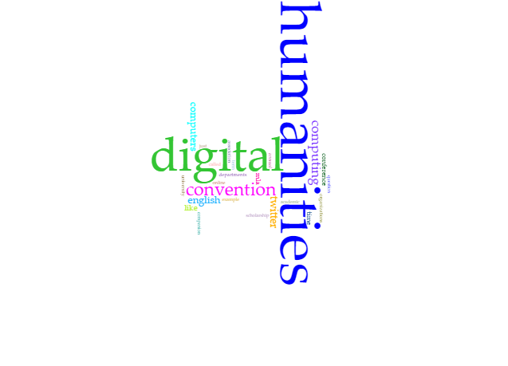

 

<h2>IASC 2P02 | Ryan Amalfitano</h2>

<h1>Blog Post - Defining Digital Humanities</h1>

 

Matthew Kirschenbaum wrote an article in 2012 titled <em>What Is Digital Humanities and What’s It Doing in English Departments?</em> to explain the titular faculty of Digital Humanities (or DH); and explain he did, both its history as a field of study, the origin of the term Digital Humanities, and the previously used Humanities Computing, as well as its significance and why it is typically placed within English departments. But not every member of the field agrees with his opinions on the origins of DH, or whether it is indeed so exclusively linked to English. In a 2016 publication of the same book series, <em>Debates in the Digital Humanities</em>, Lauren Klein and Matthew Gold challenge the idea of a rigid definition of DH in their article titled <em>Digital Humanities: The Expanded Field</em>, and bring to light several new ideas about DH's origins and meaning. So what kind of argument do these two articles present about the nature of DH?

Kirschenbaum tries, as seen in the title of his article, to argue that; “...digital humanities has accumulated a robust professional apparatus that is probably more rooted in English than any other departmental home.” (Kirschenbaum, 2012) However, Klein and Gold argue that DH should acknowledge its roots as having been placed in several disciplines: 

<blockquote>Multiple contributors to this volume take up disciplinary issues directly, exploring how their digital humanities work might speak to their home disciplines or across several disciplines—from history (Blevins) to book history (Stauffer) to the humanities writ large (Nowviskie). Just as often, contributors argue for the impact that their disciplinary homes—Africana/Black studies (Gallon), art history (Battles and Maizels), and archaeology (Watrall), to name only a few—might make to DH. This reflects a crucial decentering of the digital humanities, one that acknowledges how its methods and practices both influence and are influenced by other fields. Rather than diminish the impact of DH, however, these examples enrich its discourse and extend its reach. (Klein and Gold, 2016)</blockquote>

As Klein and Gold explain, DH can be related to many disciplines, and indeed has roots in far more than just English. Even if Kirschenbaum is correct in his statement that English is the dominant field that DH is rooted in, this does not mean that the other fields of study that inspired and continue to influence DH work are insignificant.

Kirschenbaum also argues that DH is used as a “free-floating signifier”, and that it can be taken up by any particular scholar as a way to lend some focus or control to those who lack it in their own fields or disciplines. (Kirschenbaum, 2012) This exact term of “free-floating signifier”, in fact quoted directly from Kirschenbaum's article by Klein and Gold, and is criticized for its vagueness, as they argue that this is in fact its weakness, and not its strength:

<blockquote>But where digital humanists have, for the most part, embraced the “free-floating signifier” that is DH, Krauss viewed the elasticity of her field’s designated term as a liability, a loss of precision in a discipline that, as a result of its expanding scope, demanded more, not less, specificity. (Klein and Gold, 2016)</blockquote>

Klein and Gold argue that this relaxed attitude towards DH's definition and what works can be considered to fall under DH is one of the issues with the field. Although this attitude may contribute to a sense of accessibility to those who wish to enter the field, it may also make for a lack of intimacy between members, as the loose definition means that very different works can be nonchalantly placed in the same discipline, with no deeper categorization to differentiate them or to allow those studying similar concepts to identify one another.

Through one of DH's own unique tools, the text analysis tool Voyant, we can further analyse these two articles to see how they focus on different words and how their tone conveys their authors' intent. As we can see from the first cirrus created from Kirschenbaum's article, the words “digital” and “humanities” are predictably the most used words, with “computing”, “computers”, and “convention” falling behind it. “English” is also one of the top words used, as Kirschenbaum argues that DH belongs in English departments.

 

Next, we have the cirrus from Klein and Gold, which paints a very different picture. Although “digital” and “humanities” are once again the top two words used, there are also several others that are frequently used in this article: “DH”, of course, the shorthand for Digital Humanities, as well as “field”, instead of Kirschenbaum's more specific English. This article also makes heavy use of words such as “scholar”, “pedagogy”, “volume”, and “expanded”, in its discussion about the nature of DH itself, rather than Kirschenbaum's recollection of its history. This further shows Kirschenbaum's investment in DH as a field connected to English, whereas Klein and Gold make reference to “fields” in general.

The argument on where DH came from is far from exclusive between these authors. In fact, it seems that just about any DH scholar has their own opinion on where DH is rooted, whether they write about it specifically or if they simply mention it as an offhanded comment:

<blockquote>In many respects, digital humanities is a scholarly discipline like any other. It has, first and foremost, a community with a history. It also has books and journals, scholarly societies, yearly conferences, sources of funding, programs, curricula, students, faculty, and a vast network of scholars both traditional and nontraditional. In this respect, it is more or less like history, or English, or philosophy, or mathematics.  (Ramsay, p.83, 2011)</blockquote>

The definition of Digital Humanities is still a hotly debated topic, and many scholars disagree on whether it is or should be a rigid definition or one that is more fluid. As we can see from both articles, each has their own benefits and detriments, in regards to the openness of the field as well as the danger that comes with a lack of sure scope of what is and is not Digital Humanities work. However, the only way to come to a consensus on what DH is – if one could ever be achieved – would be through arguments such as the ones made by Kirschenbaum, and by Klein and Gold. Which one do you agree with?

 

<h4>Works Cited</h4>

Kirschenbaum, M. (2012). What Is Digital Humanities and What’s It Doing in English Departments? Retrieved March 05, 2017, from http://dhdebates.gc.cuny.edu/debates/text/38

Klein, L., & Gold, M. (2016). Digital Humanities: The Expanded Field. Retrieved March 05, 2017, from http://dhdebates.gc.cuny.edu/debates/text/51

Ramsay, S. (2011). Reading Machines: Toward an Algorithmic Criticism. University of Illinois Press.

 

